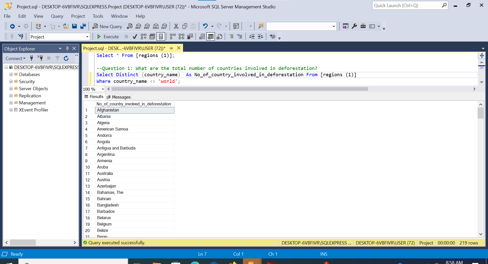
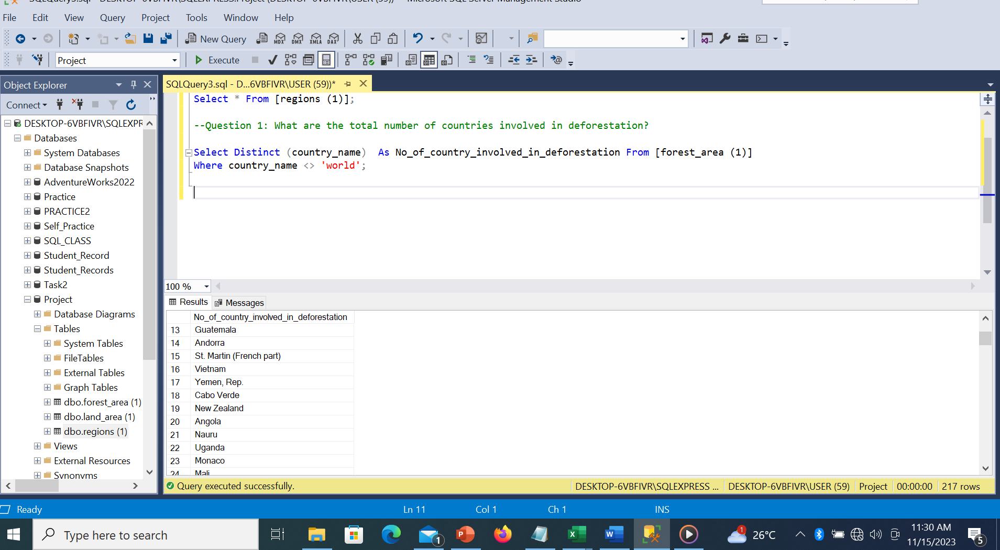
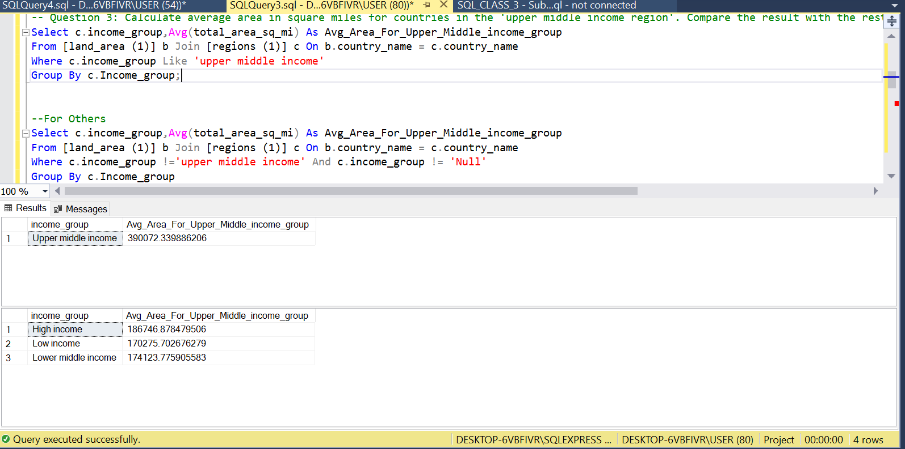
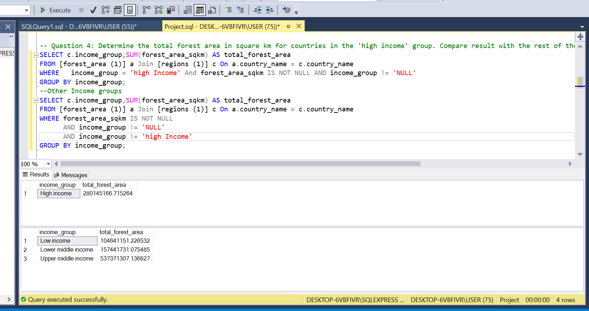

# Deforestation around the world

## Introduction

This is an SQL Project on Deforestation of diffferent countries around the world from year 1990-2016. We have three tables, the forest area table, the land area table and the region area.They all have four column each; The forest area table:country code,country name, year, forest area in sq/km, The land area table:country code,country name, year, land area in sq/mi, The region table: country code,country name,region(the region the countries are located),income group.
        
This analysis Project is to help  us reveal how deforestation rates have evolved in each country over successive years,Investigate the relationship between income groups and deforestation over time.

## Problem Statement

1. What are the total number of countries involved in deforestation? 
2. Show the income groups of countries having total area ranging from 75,000 to 150,000 square meter?
3. Calculate average area in square miles for countries in the 'upper middle income region'. Compare the result with the rest of the income categories.
4. Determine the total forest area in square km for countries in the 'high income' group. Compare result with the rest of the income categories.
5. Show countries from each region(continent) having the highest total forest areas
6. What is the percentage change in forest area compared to the total land area for each country in year 2016?
7. How does the forest area vary across each year?
8. Which countries have the highest and lowest forest area in the latest available year and show their income group?
9. Compare the average total land area of the two African region .
10. Show the income group of countries that have forest area more than 20,000,000sqkm

## Skill documented

These are some of the Sql Features used;
- Group By
- Where
- Cte
- Window Function
- Sub query
- Having

## Problem Solved

--Question 1: What are the total number of countries involved in deforestation? 

Select Distinct (country_name)  As No_of_country_involved_in_deforestation From [forest_area (1)]

Where country_name <> 'world';

Insight: The total no of rows shown for this result was first 218, Therefore I had to put <> world because world is not a country, So the total number of countries involved in deforestation is 218 countries.

-- Question 2: Show the income groups of countries having total area ranging from 75,000 to 150,000 square meter?

SELECT b.country_name, b.total_area_sq_mi, c.income_group

FROM [land_area (1)] b

JOIN [regions (1)] c ON b.country_name = c.country_name

WHERE b.total_area_sq_mi BETWEEN 75000 AND 150000;

Insight: 25 countries are in this category,but it is shown across different years.

-- Question 3: Calculate average area in square miles for countries in the 'upper middle income region'. Compare the result with the rest of the income categories.

Select c.income_group,Avg(total_area_sq_mi) As Avg_Area_For_Upper_Middle_income_group 

From [land_area (1)] b Join [regions (1)] c On b.country_name = c.country_name

Where c.income_group Like 'upper middle income'

Group By c.Income_group;

--For Others

Select c.income_group,Avg(total_area_sq_mi) As Avg_Area_For_Upper_Middle_income_group 

From [land_area (1)] b Join [regions (1)] c On b.country_name = c.country_name

Where c.income_group !='upper middle income' And c.income_group != 'Null'

Group By c.Income_group

Order By  Avg(total_area_sq_mi);

Insight: There is substantial difference in land area between Upper Middle Income countries and others in income groups.The countries in other income group should necessitate a strategic approach to land management.'

-- Question 4: Determine the total forest area in square km for countries in the 'high income' group. Compare result with the rest of the income categories.

SELECT c.income_group,SUM(forest_area_sqkm) AS total_forest_area

FROM [forest_area (1)] a Join [regions (1)] c On a.country_name = c.country_name

WHERE	income_group = 'high Income' And forest_area_sqkm IS NOT NULL AND income_group != 'NULL'

GROUP BY income_group;

--Other Income groups

SELECT c.income_group,SUM(forest_area_sqkm) AS total_forest_area

FROM [forest_area (1)] a Join [regions (1)] c On a.country_name = c.country_name

WHERE forest_area_sqkm IS NOT NULL
     
      AND income_group != 'NULL'
	 
   AND income_group != 'high Income' 

GROUP BY income_group;

Insight: The countries in the high income group are ranked has the second largest in terms of forest area. These countries should try to achieve a harmonious balance between economic prosperity and environmental conservation.
 

