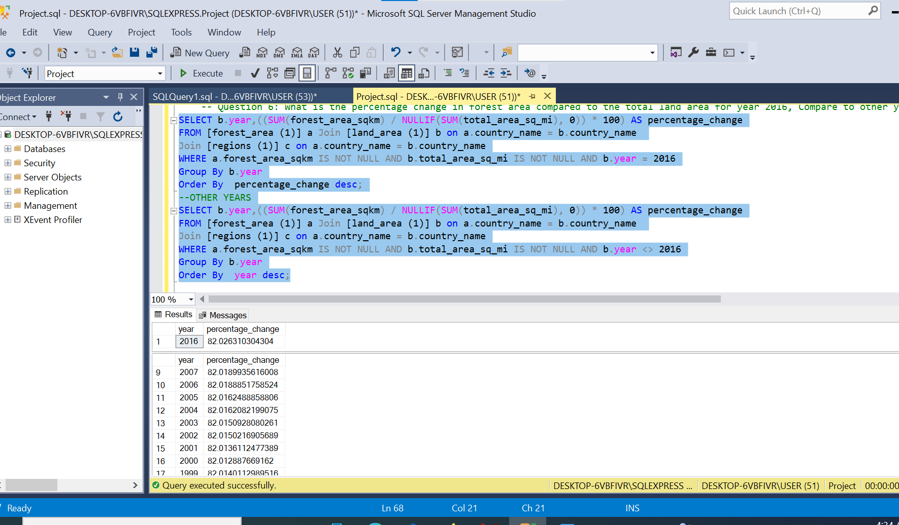

#  Analyzing Deforestation around the world

## Introduction

Deforestation is the process of clearing or removing a significant portion of a forest for human activities such as agriculture, logging, urban development, or infrastructure expansion.

This is an SQL Project on Deforestation of diffferent countries around the world from year 1990-2016. We have three tables, the forest area table, the land area table and the region area.They all have four column each; The forest area table:country code,country name, year, forest area in sq/km, The land area table:country code,country name, year, land area in sq/mi, The region table: country code,country name,region(the region the countries are located),income group.
        
This analysis Project is to help  us reveal how deforestation rates have evolved in each country over successive years,Investigate the relationship between income groups and deforestation over time.

## Problem Statement

1. What are the total number of countries involved in deforestation? 
2. Show the income groups of countries having total area ranging from 75,000 to 150,000 square meter?
3. Calculate average area in square miles for countries in the 'upper middle income region'. Compare the result with the rest of the income categories.
4. Determine the total forest area in square km for countries in the 'high income' group. Compare result with the rest of the income categories.
5. Show countries from each region(continent) having the highest total forest areas
6. What is the percentage change in forest area compared to the total land area for each country in year 2016?
7. How does the forest area vary across each year?
8. Which countries have the highest and lowest forest area in the latest available year and show their income group?
9. Compare the average total land area of the two African region .
10. Show the income group of countries that have forest area more than 20,000,000sqkm

## Skill documented

These are some of the Sql Features used;
- Group By
- Where
- Cte
- Window Function
- Sub query
- Having
- Aggregate Functions

## Problem Solved

--Question 1: What are the total number of countries involved in deforestation? 

Select Distinct (country_name)  As No_of_country_involved_in_deforestation From [regions (1)]

Where country_name <> 'world';

Insight: The total no of rows shown for this result was first 219, Therefore I had to put <> world because world is not a country, So the total number of countries involved in deforestation is 218 countries.

-- Question 2: Show the income groups of countries having total area ranging from 75,000 to 150,000 square meter?

SELECT b.country_name, b.total_area_sq_mi, c.income_group

FROM [land_area (1)] b

JOIN [regions (1)] c ON b.country_name = c.country_name

WHERE b.total_area_sq_mi BETWEEN 75000 AND 150000;

Insight: 25 countries are in this category,but it is shown across different years.

-- Question 3: Calculate average area in square miles for countries in the 'upper middle income region'. Compare the result with the rest of the income categories.

Select c.income_group,Avg(total_area_sq_mi) As Avg_Area_For_Upper_Middle_income_group 

From [land_area (1)] b Join [regions (1)] c On b.country_name = c.country_name

Where c.income_group Like 'upper middle income'

Group By c.Income_group;

--For Others

Select c.income_group,Avg(total_area_sq_mi) As Avg_Area_For_Upper_Middle_income_group 

From [land_area (1)] b Join [regions (1)] c On b.country_name = c.country_name

Where c.income_group !='upper middle income' And c.income_group != 'Null'

Group By c.Income_group

Order By  Avg(total_area_sq_mi);

Insight: There is substantial difference in land area between Upper Middle Income countries and others in income groups.The countries in other income group should necessitate a strategic approach to land management.'

-- Question 4: Determine the total forest area in square km for countries in the 'high income' group. Compare result with the rest of the income categories.

SELECT c.income_group,SUM(forest_area_sqkm) AS total_forest_area

FROM [forest_area (1)] a Join [regions (1)] c On a.country_name = c.country_name

WHERE	income_group = 'high Income' And forest_area_sqkm IS NOT NULL AND income_group != 'NULL'

GROUP BY income_group;

--Other Income groups

SELECT c.income_group,SUM(forest_area_sqkm) AS total_forest_area

FROM [forest_area (1)] a Join [regions (1)] c On a.country_name = c.country_name

WHERE forest_area_sqkm IS NOT NULL
     
      AND income_group != 'NULL'
	 
   AND income_group != 'high Income' 

GROUP BY income_group;

Insight: The countries in the high income group are ranked has the second largest in terms of forest area. These countries should try to achieve a harmonious balance between economic prosperity and environmental conservation.

-- Question 5: Show countries from each region(continent) having the highest total forest areas. 

WITH RankedCountries AS (
   
    SELECT a.country_name, c.region, a.forest_area_sqkm,
      
	ROW_NUMBER() OVER (PARTITION BY region ORDER BY forest_area_sqkm DESC) AS rank_within_region
    
    FROM [forest_area (1)] a Join [regions (1)] c On a.country_name = c.country_name
      
      Where  a.forest_area_sqkm IS NOT NULL And a.country_name != 'World' 

)

SELECT country_name,region,forest_area_sqkm

FROM RankedCountries

WHERE rank_within_region = 1;

Insight: The country with the largest forest area is russian Federation from Europe & Central Asia Region while the country with the lowest forest area is India from South Asia Region.

-- Question 6: What is the percentage change in forest area compared to the total land area for year 2016, Compare to other years?

SELECT b.year,((SUM(forest_area_sqkm) / NULLIF(SUM(total_area_sq_mi), 0)) * 100) AS percentage_change

FROM [forest_area (1)] a Join [land_area (1)] b on a.country_name = b.country_name 

Join [regions (1)] c on a.country_name = b.country_name

WHERE a.forest_area_sqkm IS NOT NULL AND b.total_area_sq_mi IS NOT NULL AND b.year = 2016

Group By b.year

Order By  percentage_change desc;

--OTHER YEARS

SELECT b.year,((SUM(forest_area_sqkm) / NULLIF(SUM(total_area_sq_mi), 0)) * 100) AS percentage_change

FROM [forest_area (1)] a Join [land_area (1)] b on a.country_name = b.country_name 

Join [regions (1)] c on a.country_name = b.country_name

WHERE a.forest_area_sqkm IS NOT NULL AND b.total_area_sq_mi IS NOT NULL AND b.year <> 2016

Group By b.year

Order By  year desc;

Insights: No significance difference in over the years in percentage change in forest area compare to land area.this shows that there was successful conservation efforts in all the country over the years.

Note: The "percentage change in forest area compared to the total land area" represents how much the forest area has changed relative to the total land area over a given period of time. 

-- Question 7: How does the forest area vary across each year?

SELECT year,SUM(forest_area_sqkm) AS total_forest_area

FROM [forest_area (1)]

WHERE forest_area_sqkm IS NOT NULL AND year IS NOT NULL

GROUP BY year

Order By total_forest_area Desc;

Insight: There is a sight decrease in the change of forest area over the years. While the remaining forested areas may still contribute to the positive percentage change, the overall quality and ecological value of the forests may be compromised.

-- Question 8:  Which countries have the highest and lowest forest area in the latest available year and show their income group?

WITH RankedCountries AS (
  
    SELECT
       
	a.country_name,c.income_group,
       
	a.forest_area_sqkm,
        
	RANK() OVER (ORDER BY forest_area_sqkm DESC) AS rank_highest,
        
	RANK() OVER (ORDER BY forest_area_sqkm ASC) AS rank_lowest
    
    FROM [forest_area (1)] a  Join [regions (1)] c ON a.country_name = c.country_name
       
	WHERE forest_area_sqkm IS NOT NULL And a.country_name <> 'world'
          
	  AND year = (SELECT MAX(year) FROM [forest_area (1)]  WHERE forest_area_sqkm IS NOT NULL)
	
 )

SELECT country_name,income_group,forest_area_sqkm,'Highest' AS ranking_type

FROM RankedCountries

WHERE rank_highest = 1

UNION ALL

SELECT country_name,income_group,forest_area_sqkm,'Lowest' AS ranking_type

FROM RankedCountries

WHERE rank_lowest = 1; 

Insights: Russia Federation's has as an upper-middle-income country with extensive forests suggests a potential alignment between economic development and sustainable forest management practices. The country may have implemented policies that balance economic growth with conservation efforts, contributing to the maintenance of substantial forested areas.

The Faroe Islands has as a high-income country with limited forest area raises questions about the challenges of environmental conservation in regions with specific ecological constraints.Strategies for sustainable land use and conservation in such areas may need to address unique environmental challenges.

-- Question 9:  Compare the average total land area of the two African region .

WITH Subsaharanafrica AS (
    
    SELECT DISTINCT b.country_name, c.income_group,b.total_area_sq_mi
    
    FROM [land_area (1)] b join [regions (1)] c on b.country_name = c.country_name
    
    WHERE region = 'Sub-saharan Africa' AND total_area_sq_mi IS NOT NULL)

SELECT AVG(total_area_sq_mi) AS avg_area_Sub_saharan_Africa

FROM Subsaharanafrica;

WITH MiddleEastNorthAfrica AS (
    
    SELECT DISTINCT b.country_name, c.income_group, b.total_area_sq_mi
    
    FROM [land_area (1)] b join [regions (1)] c on b.country_name = c.country_name
    
    WHERE region = 'Middle East & North Africa' AND total_area_sq_mi IS NOT NULL)

SELECT AVG(total_area_sq_mi) AS avg_area_Middle_East_North_Africa

FROM MiddleEastNorthAfrica;

Insight: The average total land area in Subsaharanafrica region is higher than MiddleEastNorthAfrican region.

The Sub-Saharan Africa regionexhibits a higher average total land area. The vastness of landscapes, including extensive savannas, forests, and deserts, contributes to the overall larger land area. The larger land area suggests potential economic and agricultural opportunities, including space for cultivation, diverse ecosystems supporting various industries, and potential for sustainable land use practices.

The Middle East-North Africa region, characterized by arid and semi-arid climates, showcases a comparatively smaller average total land area. Geographical constraints such as the presence of large deserts and mountainous terrain, may contribute to the reduced overall land area. The land resources may be more limited, economic activities may need to be carefully managed and diversified.

--Question 10: Show the income group of countries that have forest area more than 20,000,000sqkm

Select a.country_name, income_group,Sum(forest_area_sqkm) as total_forest_area

From [forest_area (1)] a Join [regions (1)] c ON a.country_name = c.country_name

Where a.country_name != 'world'

Group By income_group,a.country_name

Having Sum(forest_area_sqkm) > 20000000

Order By total_forest_area Desc;

Insight: There Eight (8) countries in this category,Majority of those countries are in the upper middle group while lower income group is the the least. Lower income countries may encounter obstacles related to funding, infrastructure, and competing land use demands, making it harder to maintain extensive forest cover.

## Conclusion
In the 3 tables for the Analysis.

The null values in this data set is too much,there we may not be able to get appropriate analysis. The country name and country code are all in the table making these column name ambigious. I had to put aliases on all table name to make it unique. For future reference all table should have it on primary and foreign key.

The dominance of upper-middle-income countries having more forest areas suggests a potential correlation between economic development and the capacity to preserve extensive forested areas.The lower-income countries having lower forest area raises questions about the challenges faced by nations with fewer economic resources in preserving large forested areas.

I notice while there is postive change in percentage change of forest area compared to the total land area but there a decrease in total forest area over time.
The decrease in actual forest area may also be associated with fragmentation or degradation of existing forests,
While the remaining forested areas may still contribute to the positive percentage change, the overall quality and ecological value of the forests may be compromised.

 A comprehensive analysis is crucial to understand the underlying factors and effective conservation measures to ensure the long-term sustainability of forest ecosystems.

 

